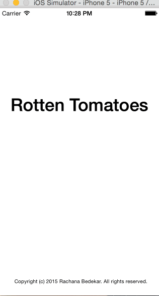

#Rotten Tomatoes

This is a Movie list application for iOS submitted as the [assignment-1] (http://courses.codepath.com/courses/intro_to_ios/week/1#!assignment)

Please note : I am using TMDB's Developer API (https://www.themoviedb.org) instead of Rotten Tomatoes API. 

Hours it took to complete : [5 hours]

* [] Required: User can view a list of movies from Rotten Tomatoes. Poster images must be loading asynchronously.
* [] Required: User can view movie details by tapping on a cell.
* [] Required: User sees loading state while waiting for movies API. 
* [] Required: User sees error message when there's a networking error. 
* [] Required: User can pull to refresh the movie list. 

